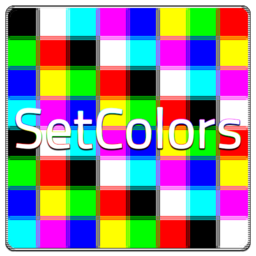
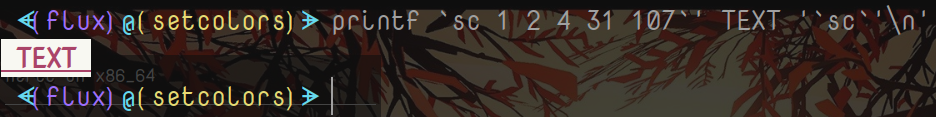
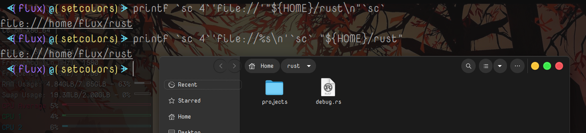
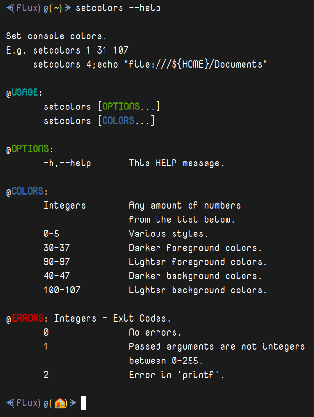
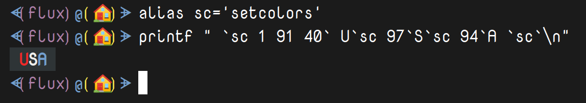

# SetColors

<a class="twitter-share-button"
  href="https://twitter.com/share?ref_src=twsrc%5Etfw&text='SetColors'%20-%20Just%20another%20way%20to%20set%20colors%20in%20Linux%20shells.%0A%0AThis%20is%20a%20command%20line%20utility%20that%20is%20a%20wrapper%20for%20setting%20colors%20in%20Linux%20shells%2Fconsoles%2Fterminals%2Fttys...%0A%0AWritten%20in%20%23RustLang%20for%20%23Linux%0A%23Programming%20%23Coding%20via%20%40thefluxapex"></a> this project.

Just another way to set *colors* in ***Linux*** shells.



|`Build`|`Status`|
|---:|:---|
![Build Status](https://img.shields.io/static/v1?logo=data:image/png;base64,iVBORw0KGgoAAAANSUhEUgAAAA4AAAAOCAMAAAAolt3jAAAABGdBTUEAALGPC/xhBQAAACBjSFJNAAB6JgAAgIQAAPoAAACA6AAAdTAAAOpgAAA6mAAAF3CculE8AAAB11BMVEUAAAA9U2GDnayLpraOqLeQqbiRqriPqLaPqLaRqriDnaw9U2Fid4SKp7iKp7hid4RfdYGHpbdYbnuCorRSaHV9nrFMYm93ma1HXGlwlKlwlKlBV2NojqQ7UV1hiKA2S1hYgpswRlJQfJcwRlIkMjlDbIVMfJpNfptOfptNfZpRfplTf5lMfJlOfptNfptDbIUkMjkHAAAuR1YzUWMzUWMzUmM0UmQzUWMyUWM0UmQzUmMzUWMzUWMuR1YHAACNsMWRs8aXt8mbuMm3ydSbuMmRs8aIrsONscWStMeZtsfk6u3k6u2ZtseStMeIrsOGrMKKr8SMr8Oswc3u8PHu8PGswc6Mr8OCqcCFrMKJrsOTssTT3OLS3OKTssSJrsOCqcB9pr5/p7+CqcCApryYs8Sdt8aApryCqb9/p799pr52obp4o7x9o7qswc7F09vO2eCwxNCCp7x4ort2obpvnLdxnbd9orjK1t3T3OLK1t7Y4OSFp7twnLZvnbdomLRolrKTsMHb4eWju8mRrsDd4+aiushplrJomLRhkrBik7Bmkq25ydLY3uLW3eHI09ptl69hkrBhkrBZjq1bj65ej613nbSRrr+etsV3nbRika1bjq5Zjq3///97NWaUAAAAP3RSTlMAAlOMioqKioqKUwIMwcEMDsQOxA7EDsQOxMQOxA7EDsQOxA4Lq/Lv7+/v7+/v76sLASI+Pj4+Pj4+Pj4+IgH2SccMAAAAAWJLR0SccbzCJwAAAAd0SU1FB+QIGBYnM5liyzQAAADPSURBVAjXY2BABYxMzCysbOwcnKwszFzcDDy89g6OTs7OLo6u9nz8DAKCbu4enl7ePr7ufoICDELC/gGBQcEhoWEB/sJCDCKi4RGRUdExsXER8aIiDGLiCYlJySmpaekZmeJiDBKSWdk5uXn5BYVFxVISDNIyJaVl5RWVVdU1tTLSDLJydfUNjU3NLa1t7XKyDPIKHZ1d3T29ff0TJirIMygqTZo8Zeq06TNmzpqtpMygoqqmrqGppa2jq6emb8BgaGRsYmpmbmFpZW1jawcAIDgy9UQeYeoAAAAldEVYdGRhdGU6Y3JlYXRlADIwMjAtMDgtMjRUMjI6Mzk6NTEtMDQ6MDBWWeqAAAAAJXRFWHRkYXRlOm1vZGlmeQAyMDIwLTA4LTI0VDIyOjM5OjUxLTA0OjAwJwRSPAAAAABJRU5ErkJggg==&label=AppImage&message=Status&style=for-the-badge&color=b91d47&labelColor=1d1d1d)|

## Table Of Contents

- [SetColors](#setcolors)
  - [Table Of Contents](#table-of-contents)
  - [About This Project](#about-this-project)
    - [Description](#description)
    - [Motivation](#motivation)
  - [Usage](#usage)
    - [Environment](#environment)
      - [Where to use](#where-to-use)
      - [Dependencies](#dependencies)
    - [Ways To Use](#ways-to-use)
      - [Portable](#portable)
        - [Binary Executable](#binary-executable)
        - [AppImage](#appimage)
      - [Installation](#installation)
        - [Debian](#debian)
    - [Examples](#examples)
  - [Project](#project)
    - [Project Links](#project-links)
    - [Project Files](#project-files)
  - [Media](#media)
    - [Logo](#logo)
    - [Screenshots](#screenshots)
      - [Help Message](#help-message)
      - [Demo](#demo)
  - [License](#license)
  - [Reference](#reference)

## About This Project

### Description

This is a *command line utility* that is a wrapper for setting colors in ***Linux*** shells/consoles/terminals/ttys; whatever you want to call them.

This essentially replaces something like; (given `alias sc='setcolors'`):
`'\033[1;31mText\033[0m'`
with something like:
`$(sc 1 31)Text$(sc)`, but this is just a very basic example as this can be used programmatically and can be passed arrays. You can find more examples on this page.

This will not override any normal color stuff you have going on in your environment just as if you were using escape sequence colors in the same way.

### Motivation

Sometimes I like to be able to set console colors without direct escape sequenced colors; I'd prefer to pass colors and styles as arguments or arrays of arguments to a program and with this program I can do so easier. This a rewrite of a program I wrote in *Fortran*⁽[¹](#reference)⁾. and of functions I've written many times in various environments.

## Usage

This is a compiled binary executable written in **🆁🆄🆂🆃** ⁽[²](#reference)⁾.

### Environment

This is a ***Linux***⁽[³](#reference)⁾ *command line utility*⁽[⁴](#reference)⁾.

#### Where to use

This can be used in any place you can receive command line output (`stdout`); so any shell, console, terminal, tty, script, or other program that can display output in a command line.

#### Dependencies

There are absolutely no dependencies.

### Ways To Use

Since this has 0 dependencies this can be used portably or installed. There is one installable `.deb` package or 2 portable methods; the simple `file` or the `.AppImage`.

If you install it with the `.deb` package it will install to `/usr/bin/setcolors` and you can simply run it anywhere.

As with any portable application in any operating system if you want to run it by it's file name then the program `file` must be in a directory that's in the *PATH* variable. In *Linux* this is the `$PATH` variable. If the `file` is not in `$PATH` then to be executed you must provide the full **`/path/to/file`**.

As with any executable file in Linux you make have to grant these files executable permission with either:
```Bash
chmod +x /path/to/setcolors # or u+x for user only
# or
chmod 755 /path/to/setcolors-x86_64.AppImage # 744 or 700 for user only
```

#### Portable

This is a self contained *Rust* binary executable with no dependencies and so is easily portable. There isn't necessarily a need for the *AppImage*, but it's there for those who prefer that method. The binary and AppImage are used in the exact same way.

##### Binary Executable

|File Name|File Description|
|:---|:--|
|`setcolors`|*Rust* - `file` - binary executable.|

##### AppImage

|File Name|File Description|
|:---|:--|
|`setcolors-x86_64.AppImage`|*AppImage* - `.AppImage` - binary executable.|

#### Installation

##### Debian

|File Name|File Description|
|:---|:--|
|`setcolors.deb`|*Debian* - `.deb` - installable file.|

You can install this `.deb` package with:

```Bash
sudo dpkg -i /path/to/setcolors.deb
```

### Examples

Non-exhaustive list of examples.

All examples assume an alias to 'sc':

```Bash
 $ alias sc='setcolors'
```

1. Set bold dark red underlined text with a white background. 
```Bash
printf `sc 1 2 4 31 107`' TEXT '`sc`'\n'
```


2. Create a clickable file in many terminal programs.
```Bash
printf `sc 4`'file://'"${HOME}\n"`sc`
```
or
```Bash
printf `sc 4`'file://%s\n'`sc` "${HOME}"
```
 

3. Print blinking 'USA' in red, white, and blue with a black background.
```Bash
printf  \
`sc 1 5 91 40`'             \n     U'\
`sc 97`'S'\
`sc 94`'A     \n             \n'\
`sc`
```


4. Help Message
```Bash
setcolors --help
```
```Bash

 Set console colors.
 E.g. setcolors 1 31 107 
      setcolors 4;echo "file:///${HOME}/Documents"

 @USAGE:
	setcolors [OPTIONS...]
	setcolors [COLORS...]

 @OPTIONS:
	-h,--help	This HELP message.

 @COLORS:
	Integers	Any amount of numbers
			from the list below.
	0-5		Various styles.
	30-37		Darker foreground colors.
	90-97		Lighter foreground colors.
	40-47		Darker background colors.
	100-107		Lighter background colors.

 @ERRORS: Integers - Exit Codes.
	0		No errors.
	1		Passed arguments are not integers
			between 0-255.
	2		Error in 'printf'.

````

## Project

There are 3 main files (you only need one; your choice, of course) and all can be found in the **Continuous Build** section of ***Releases*** at this repositories home page. Here you will find links to all files involved.

### Project Links

|Link|Description|
|:---|:---|
|[Continuous.setcolors@github.com](https://github.com/Lateralus138/setcolors/releases/tag/Continuous)|Continuous stable release page. All current files. This is the recommended option.|
|[setcolors@github.com](https://github.com/Lateralus138/setcolors)|This repository.|
|[setcolors@github.io](http://lateralus138.github.io/setcolors)|This repository - themed.|

### Project Files

Get the files directly from here if you like.

|Link|Description|
|:---|:---|
|[setcolors.deb - Continuous](https://github.com/Lateralus138/setcolors/releases/download/Continuous/setcolors.deb)|The most up-to-date Debian package installer.|
|[setcolors - Continuous](https://github.com/Lateralus138/setcolors/releases/download/Continuous/setcolors)|The most up-to-date portable `file` executable.|
|[setcolors-x86_64.AppImage - Continuous](https://github.com/Lateralus138/setcolors/releases/download/Continuous/setcolors-x86_64.AppImage)|The most up-to-date portable `AppImage` executable. |

## Media

### Logo


### Screenshots

#### Help Message



#### Demo



## [License](./docs/license/LICENSE)


>This program is free software: you can redistribute it and/or modify it under the terms of the GNU General Public License as published by the Free Software Foundation, either version 3 of the License, or (at your option) any later version.

>This program is distributed in the hope that it will be useful, but WITHOUT ANY WARRANTY; without even the implied warranty of MERCHANTABILITY or FITNESS FOR A PARTICULAR PURPOSE.  See the GNU General Public License for more details.

## Reference

<a name="reference"></a>

|#|Item|Description|Link|
|:---:|---:|:---:|:---|
|¹|*Fortran*|The "Fortran" programming language.|[Fortran@en.wikipedia.org](https://en.wikipedia.org/wiki/Fortran)|
|²|**🆁🆄🆂🆃**|The "Rust Lang" programming language.|[rust-lang.org](https://www.rust-lang.org/)|
|³|***Linux***|The "Linux" operating system.|[Linux@en.wikipedia.org](https://en.wikipedia.org/wiki/Linux)|
|⁴|*command line utility*|A tool for a command line interface (CLI).|[Console_application@en.wikipedia.org](https://en.wikipedia.org/wiki/Console_application)|

---

|Description|Status|
|:---:|:---:|
|Total downloads for this project||

---